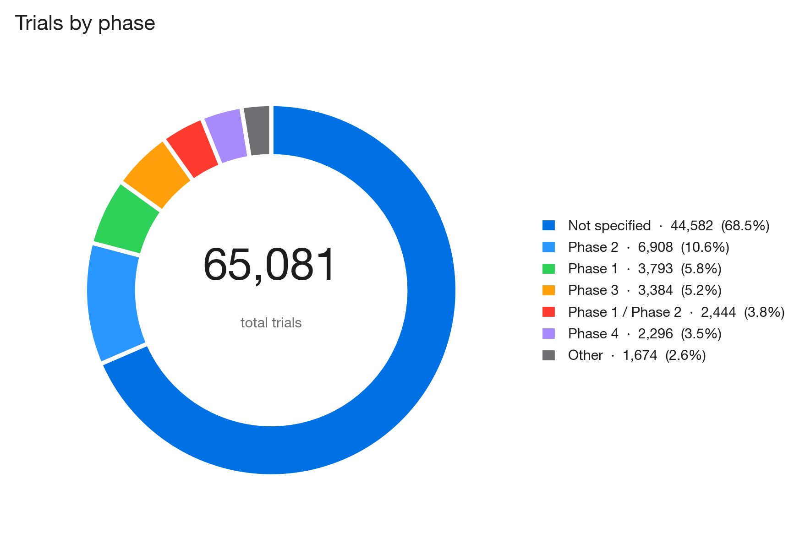

# CureMatch
### Matching Clinical Trials With Large Language Models

> Enter a patient profile → get ranked against **65,081 real ClinicalTrials.gov
> studies** in seconds, with per-criterion verdicts and plain-English
> explanations generated by an LLM.



```
Next.js 14  ·  TypeScript  ·  SQLite  ·  Python rule parser
Llama 3.3 70B (Groq)  ·  LoRA fine-tune on Llama 3.2 1B
React Three Fiber  ·  GSAP + Lenis
```

---

## Why this exists

80% of clinical trials miss their enrollment deadlines. Meanwhile 300,000
patients every year go looking for a trial and give up — because every trial
publishes its eligibility as a wall of medical prose on ClinicalTrials.gov.
There are 65,081 actively recruiting studies right now.

**No patient reads 65,081 trials.** CureMatch does.

---

## The one-sentence architecture

> **LLMs read prose. Rules make decisions. Humans verify.**

- **Ingestion** pulls every actively-recruiting trial from the ClinicalTrials.gov
  API into SQLite.
- **A rule-based parser** (RxNorm drug dictionary + regex) extracts structured
  fields — excluded medications, lab thresholds, ECOG ranges — into a derived
  `parsed.db`.
- **A deterministic scoring engine** compares a patient profile against every
  parsed trial across 6 criteria and returns ranked matches.
- **An LLM** (Llama 3.3 70B via Groq) narrates match results in plain English
  and answers patient questions grounded in each trial's published text.
- **The LLM never touches the matching decision.** Matching is deterministic,
  reproducible, auditable.

---

## Live demo walkthrough

**`/match`** — 5-step profile form (age, gender, conditions, meds, labs, location).
Condition autocomplete hits the real DB and returns *"Type 2 Diabetes — 258 trials."*

**`POST /api/match`** — SQL pre-filter narrows 65,081 → ~1,500 candidates in
milliseconds. Bulk-loads parsed fields. Scores each candidate on 6 weighted
criteria. Sorts. Returns top 150.

**`/results`** — 3D globe showing sites of matched trials, ranked list with
color-coded match scores and criterion dots (green / yellow / red).

**`/trial/[id]`** — full eligibility breakdown with the patient's actual values
against the trial's actual requirements: *"You (HbA1c 6.2) → Required (≥ 7.5) — excluded."*

**`POST /api/match/explain` · LLM #1** — click *"Explain this match in plain English"*
and the LLM takes the deterministic verdicts and writes a 2-sentence narrative
naming the strongest positives and any exclusions.

**`POST /api/chat/[nctId]` · LLM #2** — ask a question about the trial. The
agent answers grounded in that trial's eligibility text. Out-of-context
questions are refused: *"The trial's public information doesn't specify that."*

---

## Architecture

```
                  ┌──────────────────────────────────────┐
                  │  ClinicalTrials.gov API v2 (public)  │
                  └───────────────┬──────────────────────┘
                                  │  ingest (fetch_trials.py)
                                  ▼
                  ┌──────────────────────────────────────┐
                  │  data/trials.db  (SQLite, read-only) │
                  │  • 65,081 trials                     │
                  │  • 411,042 locations (lat/lng)       │
                  │  • 236,300 interventions             │
                  └───────────────┬──────────────────────┘
                                  │
                ┌─────────────────┴───────────────────┐
                │                                     │
        ┌───────▼──────────┐                ┌─────────▼────────┐
        │  scripts/        │                │  /api/match      │
        │  parse_rules.py  │                │  (Next.js route) │
        │  RxNorm + regex  │                │  reads both DBs  │
        │  ~86 sec for 65k │                └─────────┬────────┘
        └───────┬──────────┘                          │
                │                                     │
                ▼                                     │
        ┌─────────────────────────────────┐           │
        │  data/parsed.db (derived)       │◄──────────┘
        │  • medications_excluded         │
        │  • lab_thresholds               │
        │  • ecog                         │
        │  • source, confidence, version  │
        └──────────────┬──────────────────┘
                       │
                       ▼
          ┌────────────────────────────────┐
          │  Scoring engine (lib/scoring)  │   ◄── 100% deterministic,
          │  rule-based, deterministic     │       same input → same output,
          │  → per-criterion verdicts      │       auditable per trial.
          └──────────────┬─────────────────┘
                         │
                         ▼
          ┌────────────────────────────────┐
          │  User-facing LLM layer         │
          │  • /api/chat/[nctId]           │    ◄── Llama 3.3 70B via Groq
          │    RAG — grounded in trial text│
          │  • /api/match/explain          │
          │    narrative from verdicts     │
          └────────────────────────────────┘
```

---

## The LLM layer

### 1. Production chat agent (`POST /api/chat/[nctId]`)
Llama 3.3 70B via Groq, streaming at ~500 tokens/sec. RAG-grounded in the
trial's eligibility text. System prompt forbids answering outside that text —
out-of-context questions return a scripted refusal.

### 2. Match explainer (`POST /api/match/explain`)
Takes the deterministic verdicts (already computed), serializes them into a
compact string, and asks the LLM for a ≤80-word plain-English narrative. The
LLM only narrates — it cannot change the match outcome.

### 3. LoRA fine-tune of Llama 3.2 1B (controlled experiment)
We built a 450-pair Q&A training set auto-generated from our parser's
structured output (`scripts/build_training_dataset.py`) and fine-tuned with
LoRA rank 16, 3 epochs on a free Colab T4 (`notebooks/finetune_curematch.ipynb`).
This proves that parser-grounded training data improves grounded-refusal
behavior on a small model. Production continues to use the 70B base model.

### Why rules decide the match, not the LLM

Medical matching must be deterministic. If someone asks *"why was this patient
excluded from this trial?"* we need to point at a rule, not shrug.

```
You (HbA1c 6.2)  →  Required (≥ 7.5)  →  excluded.
```

That verdict comes out the same every time. An LLM wouldn't.

### Where the LLM does expand matching

The rule parser covers 33% of trials cleanly. The other 67% have compound
criteria, negation, and paraphrase that regex can't parse. Replacing the
regex parser with an LLM parser is the single highest-impact next step — and
the schema is already set up for it (`parsed_eligibility.source` column
distinguishes `rules` vs `llm`).

---

## Repository layout

```
CureMatch/
├── data/                          # NOT in git — see "Running locally"
│   ├── trials.db                  # 1.1 GB — regenerate via fetch_trials.py
│   ├── parsed.db                  # 112 MB — regenerate via parse_rules.py
│   ├── raw/                       # original API page dumps
│   ├── training/                  # 450 Q&A pairs for LoRA fine-tune ← IS in git
│   └── charts/                    # matplotlib PNGs for the deck
├── fetch_trials.py                # one-time ingest from ClinicalTrials.gov
├── scripts/
│   ├── parse_rules.py             # rule-based parser → parsed.db
│   ├── eval_parser.py             # random-sample evaluation
│   ├── build_training_dataset.py  # generate Q&A pairs from parsed data
│   ├── generate_stats.py          # aggregate corpus-stats.json
│   ├── generate_chart_images.py   # matplotlib PNGs for the deck
│   └── build_presentation.py      # assembles the .pptx
├── notebooks/
│   └── finetune_curematch.ipynb   # LoRA training notebook for Colab T4
├── frontend/
│   ├── src/app/
│   │   ├── (pages)                # /, /match, /results, /trial/[id], /saved, /about, /data
│   │   └── api/                   # match, trials/[id], chat, match/explain, conditions, stats
│   ├── src/lib/
│   │   ├── db.ts                  # readonly trials.db singleton
│   │   ├── parsed-db.ts           # parsed.db singleton
│   │   ├── scoring.ts             # deterministic match engine (6 criteria)
│   │   └── llm.ts                 # pluggable Groq / Anthropic / OpenAI / Ollama
│   └── src/components/
│       ├── three/                 # R3F scenes (DNA helix, globe, molecule)
│       ├── chat/                  # TrialChatPanel, MatchExplainer
│       ├── dashboard/             # CorpusDashboard with Recharts
│       ├── forms/                 # SearchableSelect, LocationMap
│       └── results/               # TrialCard, FilterSidebar, MapView
├── HOW_IT_WORKS.md                # 6-moment walkthrough of the running app
├── IDEAL_SYSTEM.md                # thesis-level 9-layer architecture
├── PRESENTATION.md                # 12-min 3-person speaker script
└── CLAUDE.md                      # original product spec
```

---

## Running locally

```bash
# 1 · Clone
git clone https://github.com/meetgajjarx07/curematch.git
cd curematch

# 2 · Fetch the trial data (~20 min, one time)
python3 fetch_trials.py

# 3 · Run the rule-based parser (~86 seconds)
python3 scripts/parse_rules.py

# 4 · Configure the LLM backend
cp frontend/.env.example frontend/.env.local
# Edit frontend/.env.local and paste your free Groq key
# (get one: https://console.groq.com/keys)

# 5 · Install + run frontend
cd frontend
npm install --legacy-peer-deps
npm run dev
```

Open **http://localhost:3000** — use the demo patient buttons on `/match`
to skip the form and land straight on ranked results.

---

## Regenerating the deck + charts

```bash
# Corpus statistics → frontend/public/corpus-stats.json
python3 scripts/generate_stats.py

# matplotlib chart PNGs → data/charts/
python3 scripts/generate_chart_images.py

# 16-slide .pptx → CureMatch_Presentation.pptx
python3 scripts/build_presentation.py
```

---

## API routes

| Route | Method | Purpose |
|---|---|---|
| `/api/stats` | GET | Trial / country / location counts |
| `/api/conditions/search?q=` | GET | Condition autocomplete, ranked by trial count |
| `/api/match` | POST | Score profile against 65k trials, return top N |
| `/api/trials/[id]` | GET | Single trial + locations + interventions + scoring |
| `/api/trials/batch` | POST | Bulk fetch (for saved trials) |
| `/api/chat/[nctId]` | POST | LLM chat, grounded in trial text, streaming |
| `/api/match/explain` | POST | Plain-English match narrative, streaming |

---

## Scoring weights

```
  Condition    35 / 100
  Medications  20 / 100
  Lab values   15 / 100
  Age          12 / 100
  Proximity    10 / 100
  Gender        8 / 100
```

Trials whose condition criterion returns `excluded` are dropped before
ranking — we never surface a prostate cancer trial to a breast cancer patient,
even if the other criteria align.

---

## Team

This is a final-project submission by a team of three. Each member owns a
distinct LLM contribution:

- **A — Production chat agent.** Built `/api/chat/[nctId]`, the match
  explainer route, the trial-page chat panel, and the RAG grounding prompt
  that keeps the agent from hallucinating.
- **B — Fine-tuning + dataset.** Built the 450-pair Q&A dataset from parsed
  data, authored the Colab LoRA notebook, trained and evaluated a fine-tuned
  Llama 3.2 1B adapter against the base model.
- **C — The matching pipeline.** Built the rule-based parser, the
  deterministic scoring engine, the 6-criterion weighting, and the condition
  disambiguation that prevents *"disease"* from matching every trial.

---

## Limitations

- **Research prototype.** Not validated as a medical device.
- **Parser coverage**: ~33% of trials have structured medication exclusions,
  ~29% have lab thresholds. The rest either don't specify these criteria or
  use phrasings the rules don't catch — which is why replacing the regex
  parser with an LLM is the next step.
- Trial data drifts daily — re-run `fetch_trials.py` to refresh the corpus.

---

## Further reading

- [`HOW_IT_WORKS.md`](HOW_IT_WORKS.md) — six-moment walkthrough of the running app
- [`IDEAL_SYSTEM.md`](IDEAL_SYSTEM.md) — thesis-level architecture (9 layers)
- [`PRESENTATION.md`](PRESENTATION.md) — 12-min, 3-person speaker script

---

## Credits

- Trial data: [ClinicalTrials.gov](https://clinicaltrials.gov) — U.S. National
  Library of Medicine, public domain.
- Map tiles: [CARTO](https://carto.com) light/dark basemap.
- Geocoding: [Nominatim](https://nominatim.openstreetmap.org) (OpenStreetMap).
- Inference: [Groq](https://groq.com) — Llama 3.3 70B Versatile.

MIT License.
